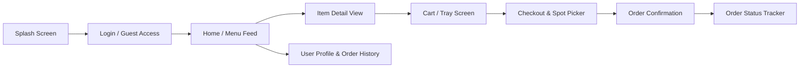

# QuickBite 🍔 – Campus Food Ordering Mobile App

> **Cross-Platform Mobile App Development & Testing In-Class Activity MVP**  
> Built with **React Native**, **TypeScript**, and **Expo SDK 57**.

[](https://reactnative.dev/)
[](https://expo.dev/)
[](https://www.typescriptlang.org/)
[](#)

---

## 📌 Project Overview

**QuickBite** is a campus canteen mobile app designed to reduce long queue times between lectures. It enables students and faculty to browse daily canteen menus, customize orders, calculate totals dynamically in **Sri Lankan Rupees (Rs.)**, place pickup requests, and track live order progress from kitchen preparation to counter pickup.

---

## 📱 App Flow & Key Screens



### Key Screens:
1. **Splash Screen**: Animated branding with automated transition to Login.
2. **Login / Guest Screen**: Campus student credentials sign-in + 1-tap Guest/Visitor access.
3. **Home Screen (Menu Feed)**:
   - Category filtering (*Meals*, *Beverages*, *Snacks*).
   - Real-time search query matching.
   - Veg-only diet filter toggle.
   - Responsive grid (2-column phone layout, 3-column tablet layout).
4. **Item Detail View**: Nutritional information (calories, prep time, ratings), special kitchen instructions note, and stepper quantity selector.
5. **Cart Screen**: Dynamic item quantities, persistent cart state across navigation, subtotal, 5% campus service fee, and total in **Rs.**.
6. **Checkout Screen**: Campus counter pickup spots and local payment options (LankaQR / Genie / FriMi, Student SmartCard, Cards, Cash).
7. **Order Confirmation Screen**: Generated order ID (`QB-XXXXXX`), estimated pickup countdown, and full receipt breakdown.
8. **Order Tracking Screen**: 3-step live kitchen timeline (`Placed` ➔ `Preparing` ➔ `Ready for pickup`).
9. **Profile Screen**: Student ID profile, spend metrics, and historical order receipts log.

---

## 🛠️ Technology Stack

- **Framework**: React Native (Expo SDK 57)
- **Language**: TypeScript
- **Navigation**: React Navigation v7 (Native Stack & Bottom Tabs)
- **Icons**: Expo Vector Icons (`@expo/vector-icons` / Ionicons)
- **State Management**: React Context API (`CartContext`) with persistent state & order progression simulation
- **Currency**: Sri Lankan Rupees (Rs. / LKR)

---

## 📂 Project Structure

```text
quickbite_app/
├── App.tsx                           # Root app wrapper & providers
├── app.json                          # Expo configuration & package definitions
├── package.json                      # Dependencies and scripts
├── tsconfig.json                     # TypeScript compiler configuration
└── src/
    ├── constants/
    │   └── theme.ts                  # Brand colors, typography, and spacing tokens
    ├── context/
    │   └── CartContext.tsx           # Global state (Cart, Subtotal, Order lifecycles, User Auth)
    ├── data/
    │   └── menuData.ts               # Local canteen dataset with items & Sri Lankan pricing
    ├── navigation/
    │   ├── AppNavigator.tsx          # Root Stack Navigator
    │   └── TabNavigator.tsx          # Bottom Tab Navigator
    ├── screens/
    │   ├── SplashScreen.tsx          # Splash screen
    │   ├── LoginScreen.tsx           # Student login & guest authentication
    │   ├── HomeScreen.tsx            # Menu feed, search & category filters
    │   ├── ItemDetailScreen.tsx      # Nutritional facts & Add to Cart
    │   ├── CartScreen.tsx            # Tray overview & subtotal calculation
    │   ├── CheckoutScreen.tsx        # Counter pickup spot & payment selection
    │   ├── OrderConfirmationScreen.tsx # Order ID & pickup receipt
    │   ├── OrderTrackingScreen.tsx   # Visual 3-stage kitchen status stepper
    │   └── ProfileScreen.tsx         # User profile details & order history
    └── types/
        └── index.ts                  # TypeScript interfaces and types
```

---

## 🚀 Getting Started

### Prerequisites
- [Node.js](https://nodejs.org/) (v18 or higher recommended)
- [Expo Go](https://expo.dev/go) app installed on your Android/iOS device (or Android Studio / Xcode simulator)

### Installation & Run

1. **Clone the repository**:
   ```bash
   git clone https://github.com/SanduniS18/QuickBite.git
   cd QuickBite
   ```

2. **Install dependencies**:
   ```bash
   npm install
   ```

3. **Start Metro Bundler**:
   ```bash
   npx expo start
   ```

4. **Launch the App**:
   - **Expo Go (Physical Device)**: Scan the QR code displayed in the terminal.
   - **Tunnel Mode (Recommended if experiencing network timeouts)**:
     ```bash
     npx expo start --tunnel
     ```
   - **Web Preview**: Press `w` in the terminal to view in your desktop browser.
   - **Android Emulator**: Press `a` in the terminal.
   - **iOS Simulator**: Press `i` in the terminal (macOS required).

---

## 🧪 Test Cases & Verification

| Test ID | Test Scenario | Expected Result | Status |
| :---: | :--- | :--- | :---: |
| **TC-01** | Splash & Login Redirection | Auto-transition to Login; successful validation with student name/ID. | ✅ PASS |
| **TC-02** | Menu Search & Category Filter | Real-time query matching and category switching filters menu items. | ✅ PASS |
| **TC-03** | Custom Item Add to Cart | Custom quantities and special instructions saved to cart state. | ✅ PASS |
| **TC-04** | State Persistence Across Screens | Cart items and totals stay preserved when switching between all tabs. | ✅ PASS |
| **TC-05** | Checkout & Order Generation | Generates unique `QB-XXXXXX` order ID and updates active order state. | ✅ PASS |
| **TC-06** | Order Tracking Lifecycle | Visual stepper transitions across `Placed` ➔ `Preparing` ➔ `Ready for pickup`. | ✅ PASS |

---

## 👩‍💻 Author & Submission
- **Repository**: [https://github.com/SanduniS18/QuickBite](https://github.com/SanduniS18/QuickBite)
- **Course**: Cross-Platform Mobile App Development & Testing
- **Assignment**: Case Study: “QuickBite” – Campus Food Ordering App
